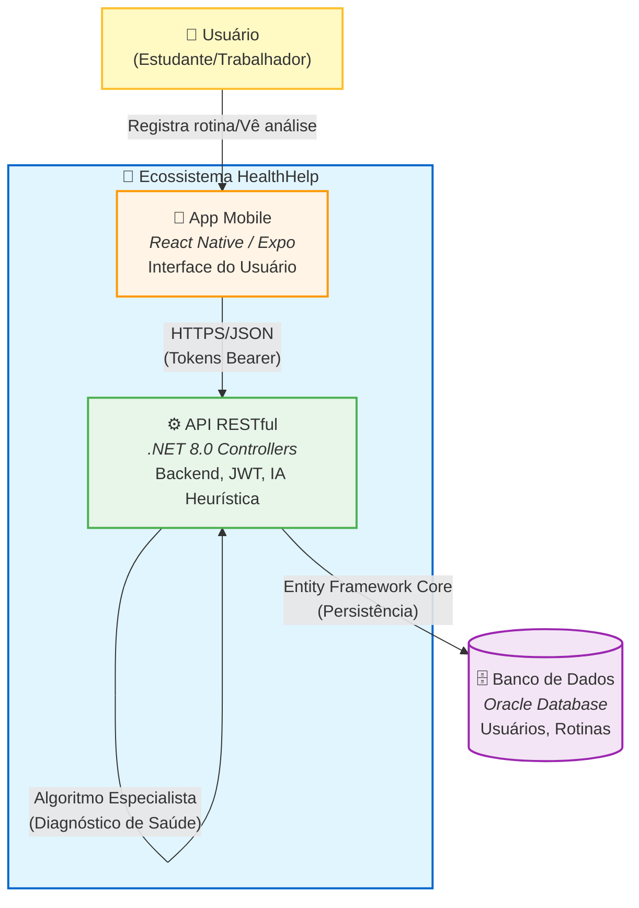

# HealthHelp API 

## Descrição da solução

HealthHelp: Monitoramento Inteligente de Bem-Estar
O HealthHelp é uma solução integrada de software desenvolvida para auxiliar no combate ao esgotamento físico e mental (burnout) e promover o equilíbrio entre vida pessoal e profissional.

O Problema: Em um cenário onde a rotina moderna é muitas vezes caótica, é difícil para o indivíduo perceber padrões nocivos — como excesso de trabalho ou privação de sono — antes que eles se tornem problemas de saúde reais.

A Solução: O aplicativo atua como um "diário inteligente". O usuário registra suas atividades diárias divididas em quatro pilares fundamentais: Sono, Trabalho, Lazer e Exercício. Diferente de um simples bloco de notas, o HealthHelp processa esses dados para gerar insights de valor.

Como Funciona a Inteligência: O coração do sistema é um Sistema Especialista (IA Heurística) hospedado na API. Este motor de regras analisa o histórico recente do usuário (médias de comportamento, consistência e volumes) para identificar arquétipos de rotina. Em vez de apenas mostrar gráficos, o sistema diagnostica o perfil atual do usuário — por exemplo, "Padrão Workaholic" (muito trabalho/pouco lazer) ou "Risco Sedentário" — e fornece uma Nota de Equilíbrio (0 a 100) junto com dicas práticas e personalizadas para melhorar a qualidade de vida naquele momento específico.

---

## Integrantes

- **Gabriel Lima Silva - RM556773**
- **Cauã Marcelo - RM558024**
- **Marcos Ramalho - RM554611**
---

## Visão do Produto e Planejamento Futuro

O **HealthHelp** não é apenas um CRUD de tarefas; ele foi projetado para ser um **Assistente Pessoal de Saúde Baseado em Dados**.

### O Problema
A rotina moderna é caótica. As pessoas não sabem se estão trabalhando demais ou dormindo de menos até que o burnout aconteça. Faltam ferramentas que transformem *dados brutos* de rotina em *insights acionáveis*.

### A Solução (HealthHelp)
Uma plataforma que coleta dados diários e utiliza um **Sistema Especialista (IA Heurística)** para diagnosticar padrões de comportamento nocivos antes que eles se tornem problemas de saúde.

### Roadmap de Evolução (IA & Data Science)
Atualmente, o sistema utiliza uma lógica heurística avançada. Os próximos passos planejados para a inteligência do sistema são:
1.  **Coleta de Sentimento:** Adicionar input diário de "Como você se sentiu hoje?" (1-5).
2.  **Dataset & Treinamento:** Cruzar os dados de *Rotina (Input)* com *Sentimento (Output)* para criar um dataset supervisionado.
3.  **ML.NET Integration:** Substituir o atual motor de regras (`RoutineAnalyzer`) por um modelo de regressão treinado no ML.NET, capaz de prever dias ruins com base na agenda do usuário e sugerir alterações proativas.

---

## Regras de Negócio

Para garantir a consistência da análise de dados, o sistema impõe regras estritas na entrada de informações:

### 1. Categorias Restritas
O sistema aceita apenas quatro categorias fundamentais para compor a "Roda da Vida" do usuário. Qualquer tentativa de cadastro fora destes termos resultará em erro `400 Bad Request`.

| Categoria | Descrição / Objetivo da Análise |
| :--- | :--- |
| **`Sono`** | Monitoramento de descanso e recuperação cognitiva. Essencial para detectar privação de sono. |
| **`Trabalho`** | Monitoramento de carga horária produtiva. Usado para calcular risco de Burnout e estresse. |
| **`Lazer`** | Tempo dedicado a hobbies e desconexão. Usado para medir qualidade de vida e saúde mental. |
| **`Exercício`** | Atividade física. Fator de proteção contra sedentarismo e regulador de humor. |

### 2. Validação de Horas
* **Mínimo:** 00:01 hora (1 minuto).
* **Máximo:** 24 horas por registro.

---

##  Arquitetura e Decisões de Design

Este diagrama ilustra os principais componentes da solução e o fluxo de dados.



### Decisões de Design

A arquitetura foi pensada para que seja algo simples porém que consegue ajudar no dia-a-dia de cada usuário!

**ASP.NET Core Web API (Controllers):** Optamos pelo uso de Controllers tradicionais para garantir uma estrutura robusta, facilitar o versionamento e permitir uma separação clara de responsabilidades, ideal para APIs que podem crescer em complexidade.

**Entity Framework Core (Oracle):** Utilização do EF Core com o provider oficial da Oracle. A abordagem Code-First com Migrations garante que a evolução do banco de dados acompanhe o código.

**Sistema Especialista (IA Heurística):** Implementamos um motor de regras encapsulado (RoutineAnalyzer) que atua como um Sistema Especialista. Em vez de depender de APIs externas (que geram custos e latência), o sistema processa internamente padrões de comportamento (Sono, Trabalho, Lazer) para gerar diagnósticos instantâneos e personalizados.

**HATEOAS & Paginação:** A API atinge o Nível 3 de maturidade de Richardson implementando HATEOAS (Hypermedia as the Engine of Application State), guiando o cliente através de links hipermídia nas respostas, além de paginação eficiente para listagens.

**Arquitetura em Camadas:** Separação clara entre Controllers (Entrada), Services (Regras de Negócio/IA), Repository/Data (Acesso a Dados) e DTOs (Transferência).

**Testes Unitários (xUnit):** A lógica crítica de análise de saúde é coberta por testes unitários utilizando banco de dados em memória, garantindo a integridade do diagnóstico.

---

## Funcionalidades

- **Autenticação Segura:** Login e Registro utilizando JWT (JSON Web Tokens) e ASP.NET Core Identity.

- **Gestão de Rotina (CRUD):** Cadastro detalhado de atividades diárias (Sono, Trabalho, Lazer, Exercício).

- **Diagnóstico Inteligente (IA):**
  - Endpoint exclusivo que analisa o histórico dos últimos 30 dias.
  - Identificação de arquétipos (ex: "Workaholic", "Privado de Sono", "Sedentário").
  - Geração de "Score de Equilíbrio" (0 a 100) e dicas personalizadas.

- **Monitoramento:** Endpoint de Health Check (`/health`) conectado ao banco de dados.

- **Versionamento:** API versionada (v1) utilizando Asp.Versioning.

- **Documentação:** Swagger UI configurado com anotações detalhadas.

---

## Instalação e Execução

### Pré-requisitos

- .NET 8.0 SDK
- Acesso a um banco Oracle
- IDE (Rider, VS Code ou Visual Studio)

### 1. Clone o Repositório

```bash
git clone https://github.com/Byells/HealthHelpApi.git
cd HealthHelp.Api
```

### 2. Configuração

Crie o arquivo `appsettings.Development.json` no projeto HealthHelp.Api com a string de conexão Oracle e chave JWT:

```json
{
  "ConnectionStrings": {
    "OracleDb": "User Id=SEU_USER;Password=SUA_SENHA;Data Source=oracle.fiap.com.br:1521/orcl"
  },
  "JWT": {
    "Key": "CHAVE_JWT",
    "Issuer": "https://localhost:7001",
    "Audience": "https://localhost:7001"
  }
}
```

### 3. Banco de Dados

Aplique as migrations para criar as tabelas:

```bash
dotnet ef database update --project HealthHelp.Api
```

> **Nota:** O sistema possui um DataSeeder que irá popular o banco com dados fictícios na primeira execução para facilitar os testes.

### 4. Executar

```bash
dotnet run --project HealthHelp.Api
```

Acesse o Swagger em: `https://localhost:44394/swagger/index.html` ou pelo link da Azure: `https://healthhelp-bce6amfkbtfkesa4.brazilsouth-01.azurewebsites.net/swagger/index.html`

---

## Executando os Testes

O projeto contém testes unitários focados na lógica do Sistema Especialista (RoutineAnalyzer).

```bash
dotnet test
```

Isso validará se a "IA" está diagnosticando corretamente cenários de Burnout, Sedentarismo e Rotinas Saudáveis.

---

## Endpoints Principais

Todos os endpoints (exceto Auth e Health) exigem o header `Authorization: Bearer <TOKEN>`.

### Autenticação

- `POST /api/v1/auth/register` - Criar nova conta
- `POST /api/v1/auth/login` - Obter token JWT

### Rotina (CRUD)

- `GET /api/v1/routineentries` - Listar histórico (Paginado + HATEOAS)
- `GET /api/v1/routineentries/{id}` - Detalhes de um registro
- `POST /api/v1/routineentries` - Adicionar atividade (Sono, Trabalho, Lazer ou Exercício)
- `PUT /api/v1/routineentries/{id}` - Atualizar atividade
- `DELETE /api/v1/routineentries/{id}` - Remover atividade

### Inteligência & Diagnóstico

- `GET /api/v1/analysis` - **O Cérebro do Sistema**. Retorna o Score de Bem-Estar, Categoria (Excelente/Ruim) e Dicas baseadas nos padrões encontrados.

### Monitoramento

- `GET /health` - Status da API e conexão com Oracle

---

### [Vídeo demonstração](https://youtu.be/Aj1V5F-_kzU)

- API feita para a Global Solution 2025/2
