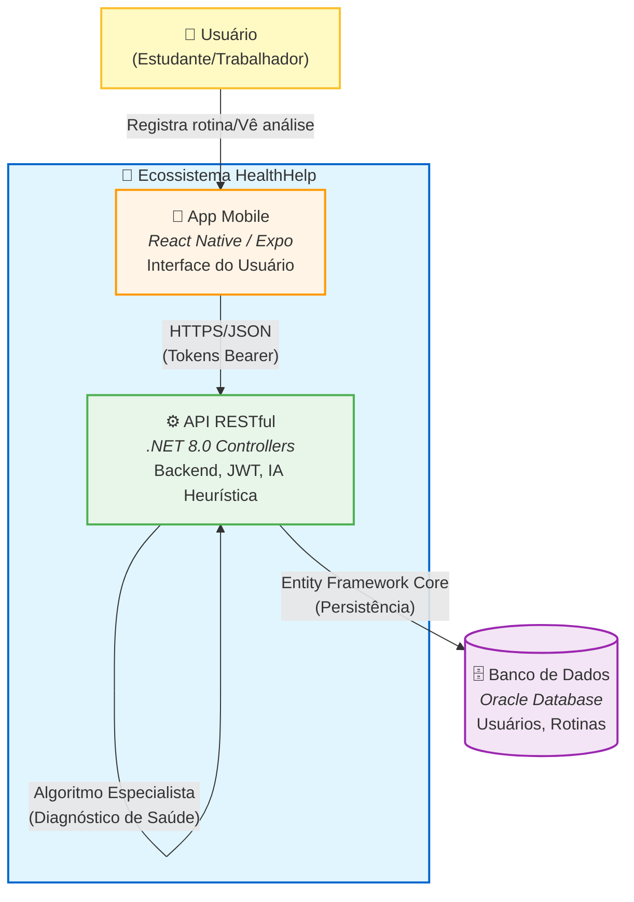

# HealthHelp API 

API RESTful desenvolvida em .NET 8 para a plataforma HealthHelp, um sistema de monitoramento de bem-estar e análise de rotina focado em prevenção de burnout e equilíbrio entre vida pessoal e profissional.

Projeto desenvolvido como parte da avaliação da disciplina de **Enterprise Application Development**.

---

## Integrantes

- **Gabriel Lima Silva - RM556773**
- **Cauã Marcelo - RM558024**
- **Marcos Ramalho - RM554611**
---

##  Arquitetura e Decisões de Design

Este diagrama ilustra os principais componentes da solução e o fluxo de dados.



### Decisões de Design

A arquitetura foi pensada para que seja algo simples porém que consegue ajudar no dia-a-dia de cada usuário!

**ASP.NET Core Web API (Controllers):** Optamos pelo uso de Controllers tradicionais para garantir uma estrutura robusta, facilitar o versionamento e permitir uma separação clara de responsabilidades, ideal para APIs que podem crescer em complexidade.

**Entity Framework Core (Oracle):** Utilização do EF Core com o provider oficial da Oracle. A abordagem Code-First com Migrations garante que a evolução do banco de dados acompanhe o código.

**Sistema Especialista (IA Heurística):** Implementamos um motor de regras encapsulado (RoutineAnalyzer) que atua como um Sistema Especialista. Em vez de depender de APIs externas (que geram custos e latência), o sistema processa internamente padrões de comportamento (Sono, Trabalho, Lazer) para gerar diagnósticos instantâneos e personalizados.

**HATEOAS & Paginação:** A API atinge o Nível 3 de maturidade de Richardson implementando HATEOAS (Hypermedia as the Engine of Application State), guiando o cliente através de links hipermídia nas respostas, além de paginação eficiente para listagens.

**Arquitetura em Camadas:** Separação clara entre Controllers (Entrada), Services (Regras de Negócio/IA), Repository/Data (Acesso a Dados) e DTOs (Transferência).

**Testes Unitários (xUnit):** A lógica crítica de análise de saúde é coberta por testes unitários utilizando banco de dados em memória, garantindo a integridade do diagnóstico.

---

## Funcionalidades

- **Autenticação Segura:** Login e Registro utilizando JWT (JSON Web Tokens) e ASP.NET Core Identity.

- **Gestão de Rotina (CRUD):** Cadastro detalhado de atividades diárias (Sono, Trabalho, Lazer, Exercício).

- **Diagnóstico Inteligente (IA):**
  - Endpoint exclusivo que analisa o histórico dos últimos 30 dias.
  - Identificação de arquétipos (ex: "Workaholic", "Privado de Sono", "Sedentário").
  - Geração de "Score de Equilíbrio" (0 a 100) e dicas personalizadas.

- **Monitoramento:** Endpoint de Health Check (`/health`) conectado ao banco de dados.

- **Versionamento:** API versionada (v1) utilizando Asp.Versioning.

- **Documentação:** Swagger UI configurado com anotações detalhadas.

---

## Instalação e Execução

### Pré-requisitos

- .NET 8.0 SDK
- Acesso a um banco Oracle
- IDE (Rider, VS Code ou Visual Studio)

### 1. Clone o Repositório

```bash
git clone https://github.com/SEU_USUARIO/HealthHelp.git
cd HealthHelp
```

### 2. Configuração

Crie/Edite o arquivo `appsettings.Development.json` no projeto HealthHelp.Api com sua string de conexão Oracle e chave JWT:

```json
{
  "ConnectionStrings": {
    "OracleDb": "User Id=SEU_USER;Password=SUA_SENHA;Data Source=oracle.fiap.com.br:1521/orcl"
  },
  "JWT": {
    "Key": "CHAVE_JWT",
    "Issuer": "healthhelp-api",
    "Audience": "healthhelp-app"
  }
}
```

### 3. Banco de Dados

Aplique as migrations para criar as tabelas:

```bash
dotnet ef database update --project HealthHelp.Api
```

> **Nota:** O sistema possui um DataSeeder que irá popular o banco com dados fictícios na primeira execução para facilitar os testes.

### 4. Executar

```bash
dotnet run --project HealthHelp.Api
```

Acesse o Swagger em: `https://localhost:7000/swagger` (ou a porta indicada no terminal).

---

## Executando os Testes

O projeto contém testes unitários focados na lógica do Sistema Especialista (RoutineAnalyzer).

```bash
dotnet test
```

Isso validará se a "IA" está diagnosticando corretamente cenários de Burnout, Sedentarismo e Rotinas Saudáveis.

---

## Endpoints Principais

Todos os endpoints (exceto Auth e Health) exigem o header `Authorization: Bearer <TOKEN>`.

### Autenticação

- `POST /api/v1/auth/register` - Criar nova conta
- `POST /api/v1/auth/login` - Obter token JWT

### Rotina (CRUD)

- `GET /api/v1/routineentries` - Listar histórico (Paginado + HATEOAS)
- `GET /api/v1/routineentries/{id}` - Detalhes de um registro
- `POST /api/v1/routineentries` - Adicionar atividade (Sono, Trabalho, Lazer ou Exercício)
- `PUT /api/v1/routineentries/{id}` - Atualizar atividade
- `DELETE /api/v1/routineentries/{id}` - Remover atividade

### Inteligência & Diagnóstico

- `GET /api/v1/analysis` - **O Cérebro do Sistema**. Retorna o Score de Bem-Estar, Categoria (Excelente/Ruim) e Dicas baseadas nos padrões encontrados.

### Monitoramento

- `GET /health` - Status da API e conexão com Oracle

---

- API feita para a Global Solution 2025/2
